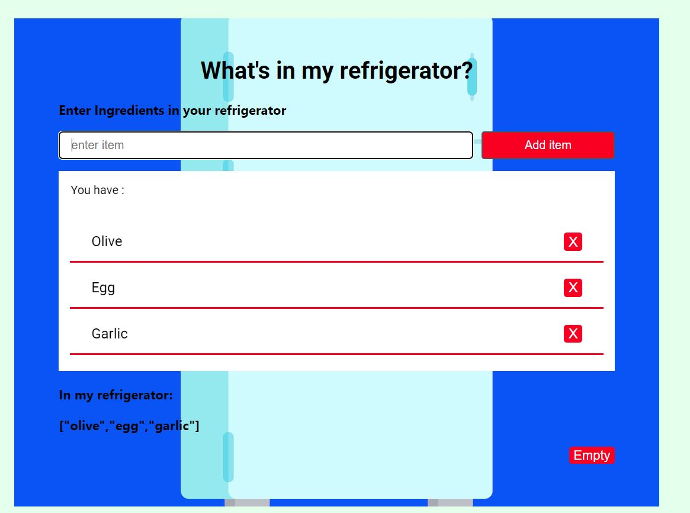
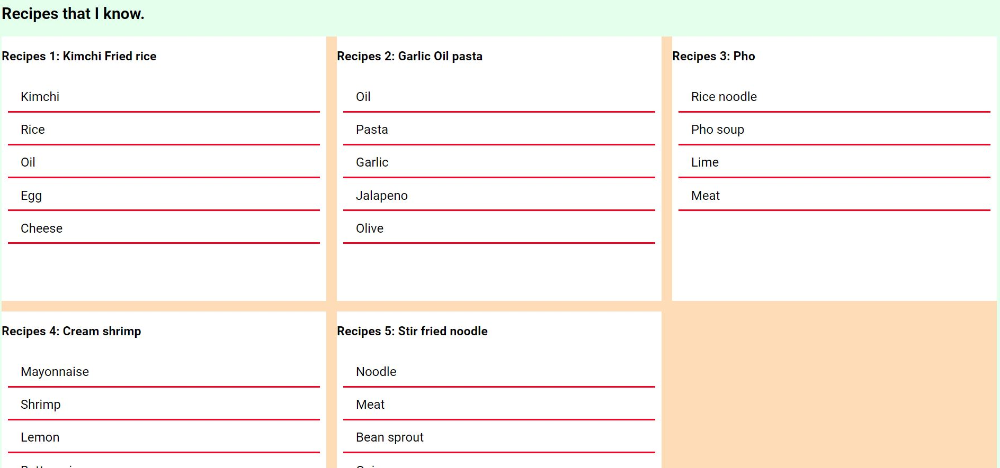
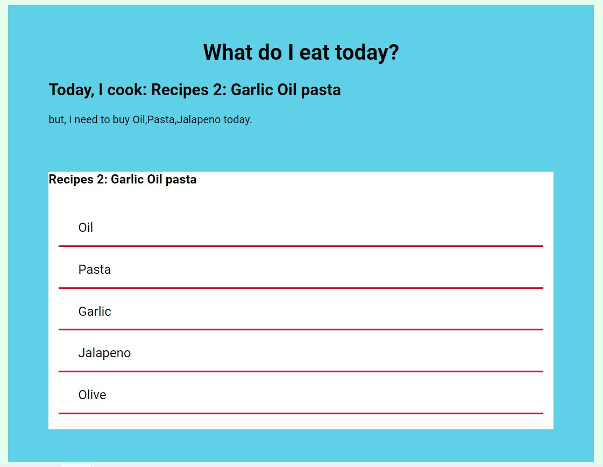
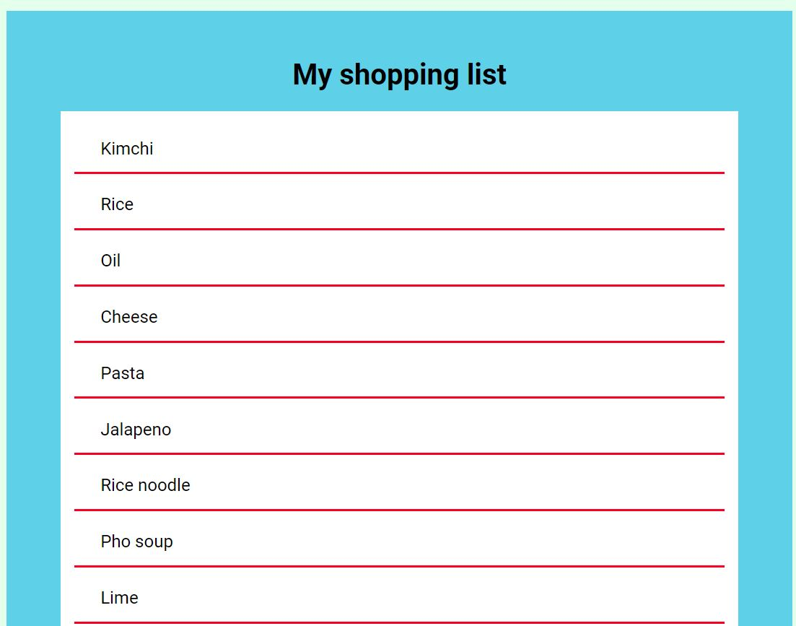

#What do I eat today?
##If you are not a fan of cooking and want to try the recipes you know only, this is the one you need.

This app shows what you can eat today and shopping lists for the next meals.
Language: HTML, CSS, JS

---
###Functions.

1. Main1. Refrigerator
  Ingredients will be saved in local storage.
  User can input ingredients by  pressing Enter key or clicking the add key.
  User can delete ingredients from the list by clicking the delete button next to the ingredients.
  User can see what's in user's refrigerator and can empty the refrigerator.

---

2. Main2. Recipe
   5 recipes are set for the testing.
   Used grid and flex for the layout.
   User can input or delete recipes from the list.(Future update)
   
---

3. Main3. What do I eat today?
   Users see the meal recommendations by comparing foods that users have and recipes that users know.
   If Users don't have all ingredient to cook the recipe, show what users need to buy more.
   
---

4. Main4. My shopping list.
Users get shopping lists for the next meals.

---

